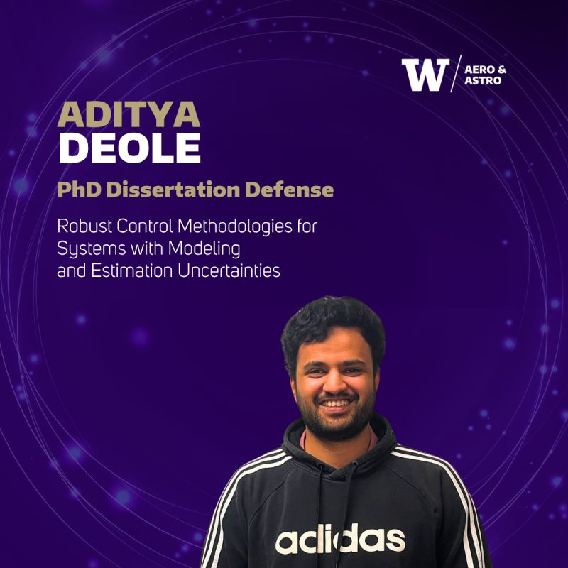
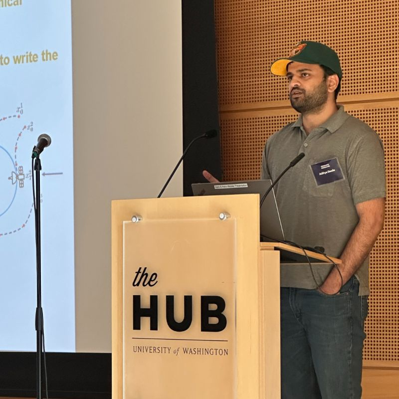
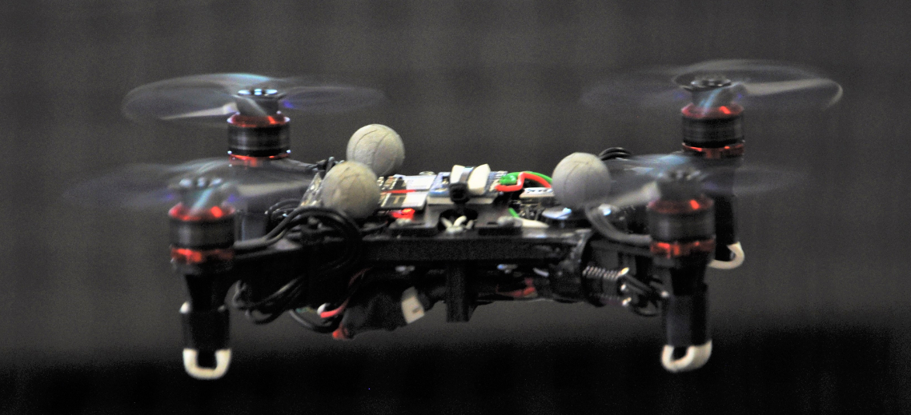
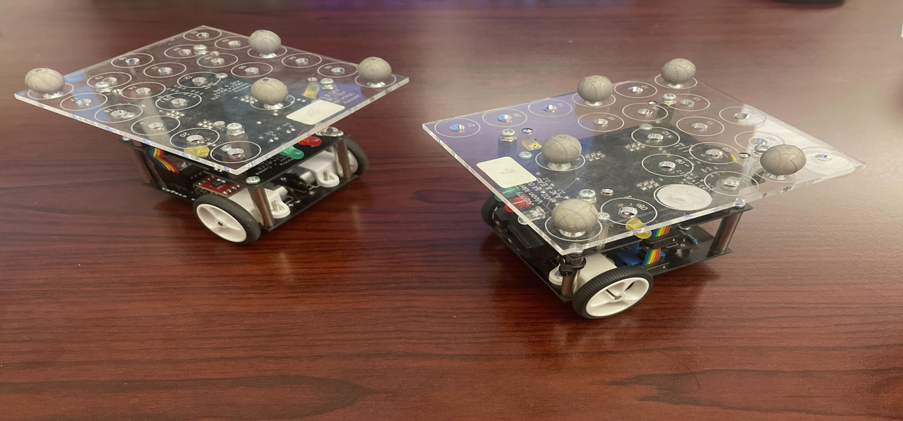

Hi, I am a PhD candidate working in Control Theory under Prof. Mesbahi at the Dept. of Aeronautics &
Astronautics, UW. I am seeking employment opportunities with research in robotics and controls, with
a focus on navigation and estimation. My past research focused on controller synthesis methods and
estimation-aware trajectory optimization for vision-guided navigation. I have investigated methods in
control theory that can safely interact with ML-driven estimation algorithms. I am also deeply invested
in solving scientific problems with control theory. Currently, I am working on a challenging problem of
system identification and manipulation solutions for Neuronal dynamics.
My main motivation for control theory comes from my background in hardware applications. I
have been working on autonomous navigation for ground and aerial robots and have supervised robotics
projects at the RAIN Lab.

======

<!--
NEWS:
Poster Presentation at NeuroAI::

Defended my Thesis:: 

Graduate Showcase 2025 ::

Robotics at Rain Lab::

 

Spacecraft Simulation Platform::

-->
