## Photorealistic Simulation Design for Vision Based Navigation
For application of a ML based state estimator used for state feedback in navigation systems, a robust simulation environment needs to be designed. I have worked on robust control and trajectory design methods for such systems. To setup these problems, a simulation environment needs to be built which can encorporate realistic visuals and emulate relistic cameras. The simulator needs to be modular enough to work with custom dynamic engines and ML algorithms that can process the image outputs. Finally a robust controller algorithm need to interact with the uncertain ML output and give the best course of action.

To facilitate this, I designed a modular sim in Unreal Engine which runs Python scripts to interact with a dynamic sim written in MATLAB or python while a thrid script runs the ML algorithm. Ive tested this for space environments where a satellite proximity operations are performed. The satellite is in a Low Earth orbit is trying to rendezvous with a uncontrolled spacecraft.

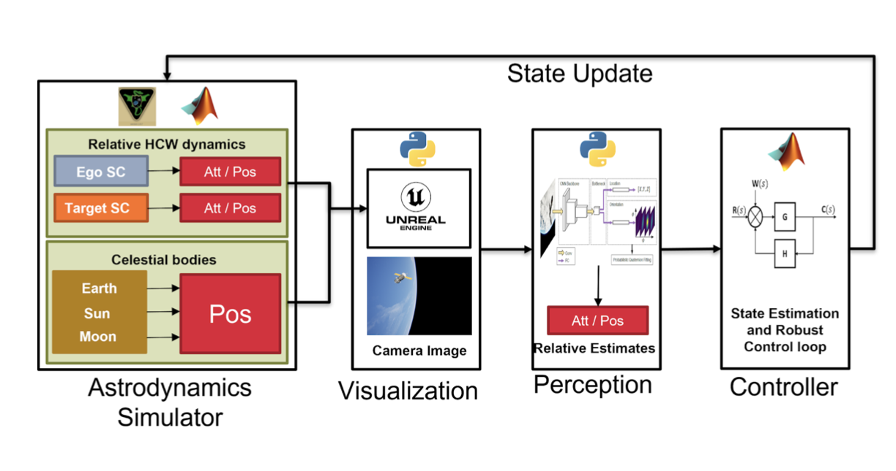

Currently there are a few UE based sims available commercially, showing the importance of such a tool in research as well as in industry.

## Controller design for systems with ML based estimation : An Applied AI problem
I have been interested in investigating use of safe methods in satellite proximity applications where Ego spacecrafts use ML to identify their Targets. This was a problem setup investigated by my colleagues at Rain Lab and our JPL. The main goal was to see which controller design would feasibile in such a scenario.

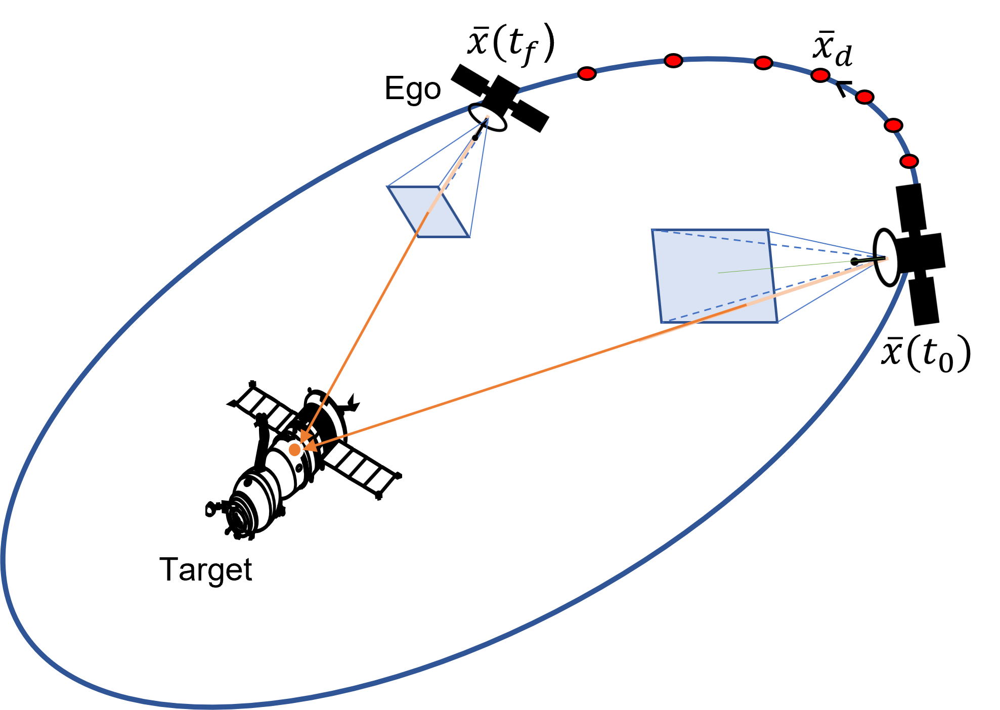

### Funnel Synthesis
We investigated funnel synthesis methods developed by [Reynold et al](https://doi.org/10.2514/6.2021-0504). The uncertainties with estimation can be modelled with respect to a nominal trajectory. Using the simulation platfor I modelled the uncertainties as slope bounds around a pre defined trajectory. We used a [Key-point CNN model developed at JPL, Becktor, **Deole** et al](https://doi.org/10.1109/AERO53065.2022.9843396) with a condition that uncertainties around the nominal tracking trajectories are slope bounded. [Newsha,**Deole** et al](https://arc.aiaa.org/doi/abs/10.2514/6.2022-2213) modified the funnel synthesis for these types of uncertainties.

<!--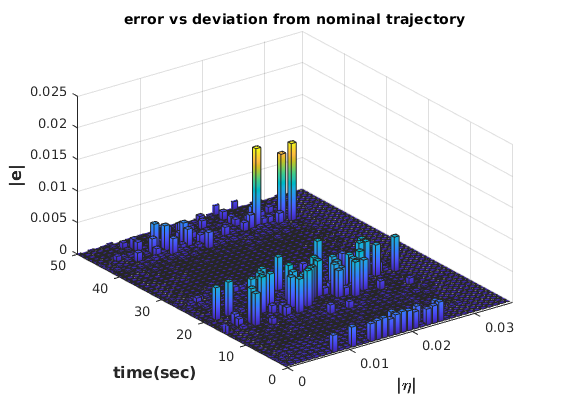-->
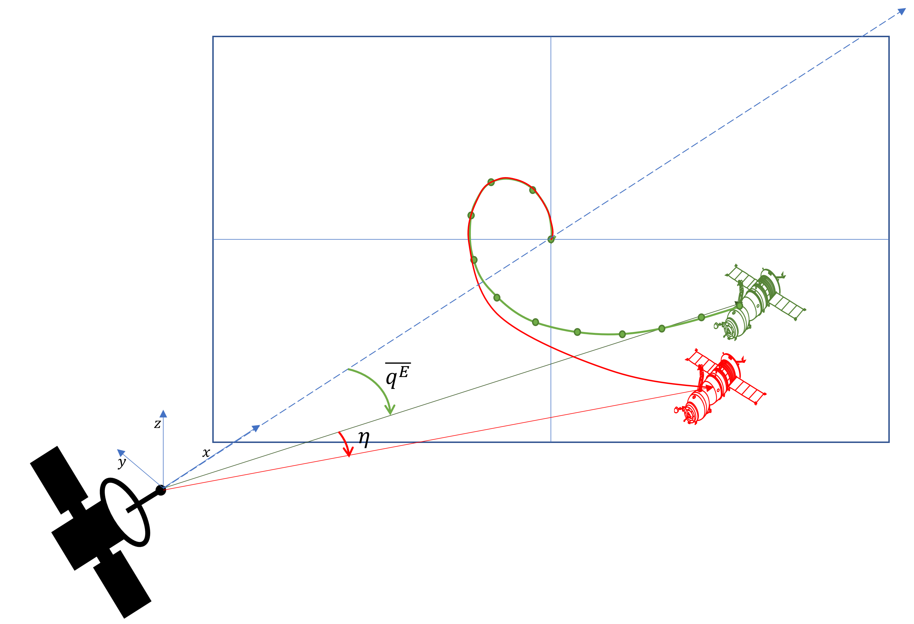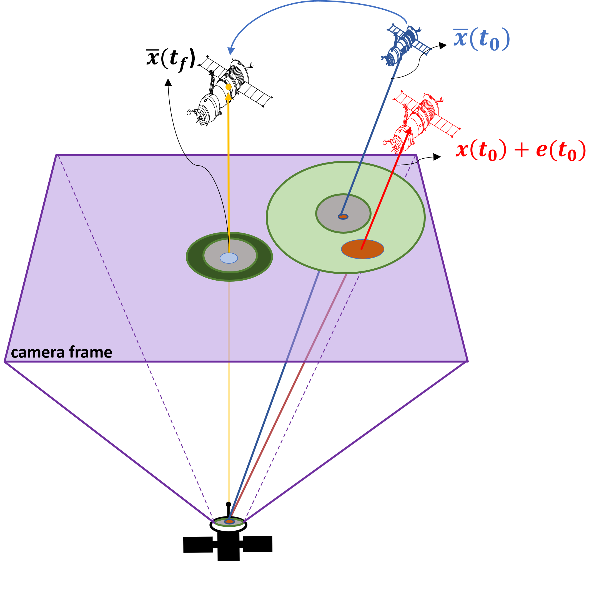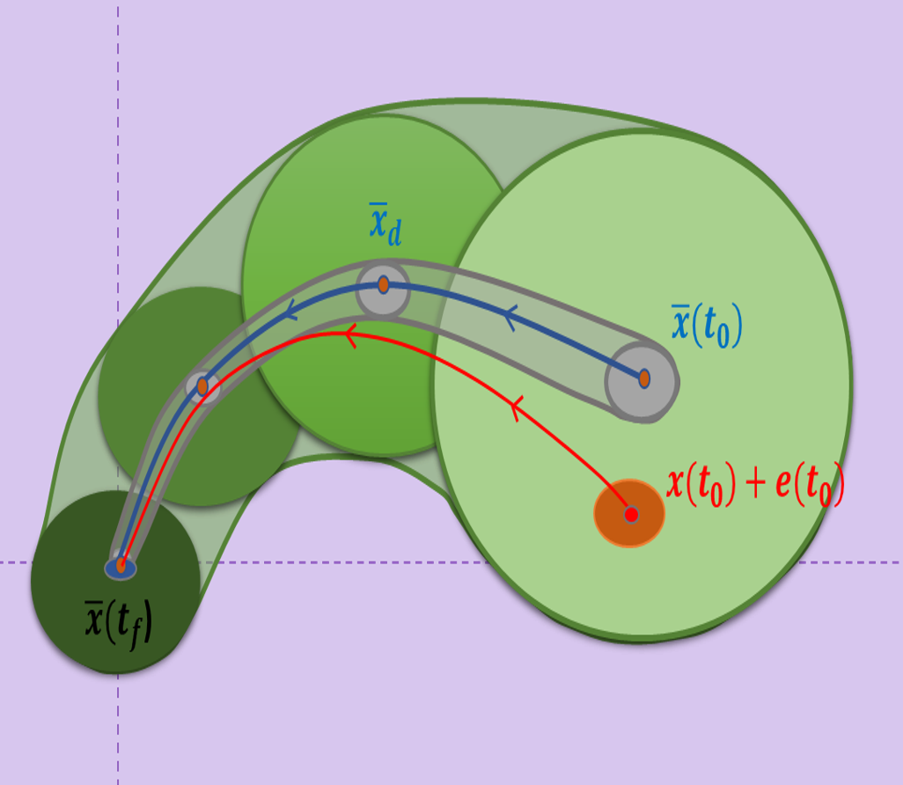

### Passivity based control
[Link to my paper](https://arc.aiaa.org/doi/abs/10.2514/6.2023-2156)

A more general approach not involving nominal trajectories to model ML uncertainty, is to use passivity based models. We use the principle that "a good ML estimator must be passive" ie it should not add extra energy to the outputs. Therefore we model the input-output characteristics of this ML map and use sector bounded non linearities to demonstrate that ML maps can be passive. Then a linear feedback controller can be designed by defining constraints, uncertainties and stability criterions as LMIs and solving for feasibility.

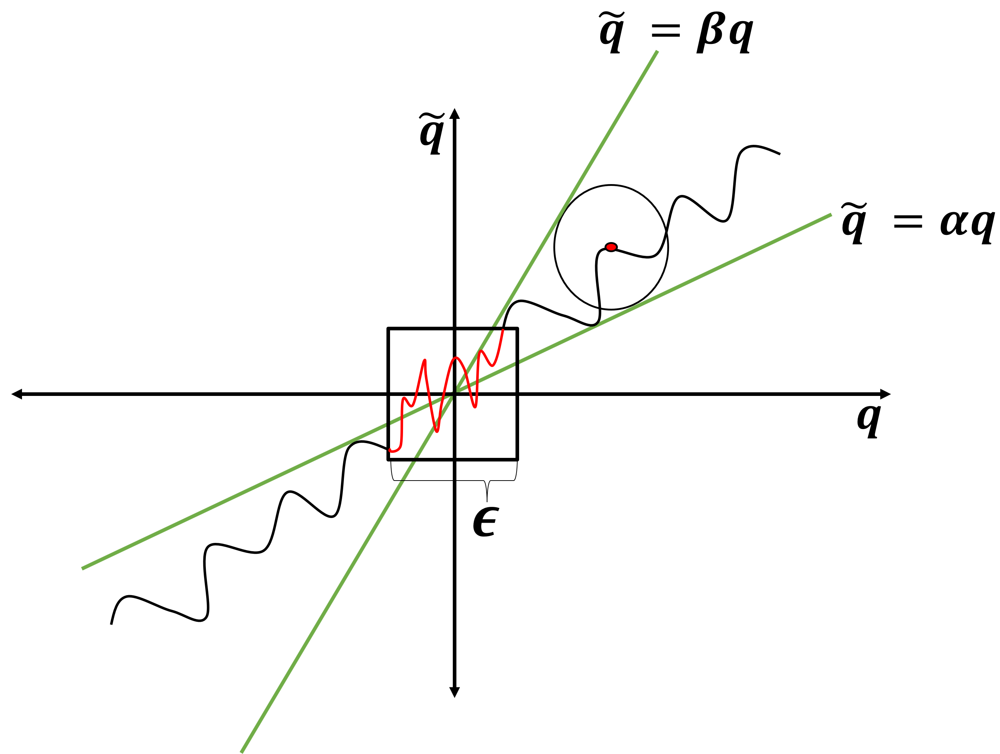

The controller makes the entire system passive, which allows us to connect multiple such systems expliting the passivity interconnection theorems. We show that consensus algorithms like max consensus and dynamic-average consensus can improve tracking.

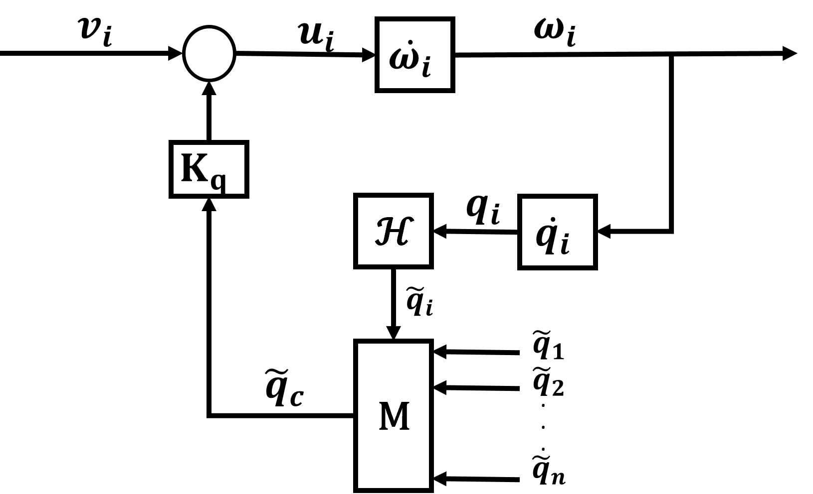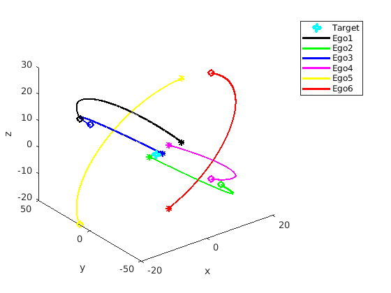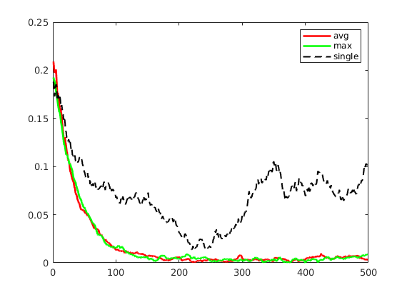

## Estimation-aware trajectory planning for set-valued uncertainty

This is my current work in estimation-aware planning. Paper under review at [Journal of Guidance navigation and Control. ](https://arxiv.org/abs/2501.09192).

We use Sequential Convex Programming to solve Estimation-aware Optimal control problem. [Code shared here](https://github.com/Rainlabuw/Obs_aware_opt).

I have investigated planning methods when ML-driven estimation is deployed in feedback. We observe that some ML platforms and more generally vision based sensing can have state dependent uncertainties. While following planned trajectories, the increasing uncertainty can cause feedback controllers to fail. So by leveraging the knowledge of the output uncertainty, I designed an algorithm to generate estimation-aware trajectories. Specifically for complex cases where probability distribution of noise may not be known but it can be defined as a bounded set. We leverage concepts of set-based observability to design the trajectories which improve estimation alongside task completion.

Here we use keypoint-based CNN which has least uncertainty when illumination is optimized, we model this behavior using our UE-based sim and design the trajectory to optize estimation alongside estimation

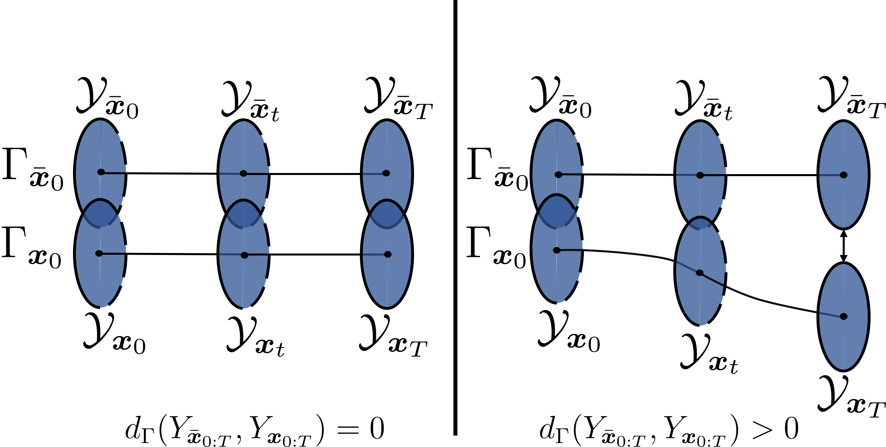

### single agent
For single agent case we show an example of Target tracking problem where an Ego spacecraft chases a Target by exploiting illumination as it improves its sensor performance. We show that overall state variance is reduced. [See paper](https://arxiv.org/abs/2501.09192). 

https://github.com/user-attachments/assets/9319358f-9748-42d8-91e5-d8ef830f4781

<!--
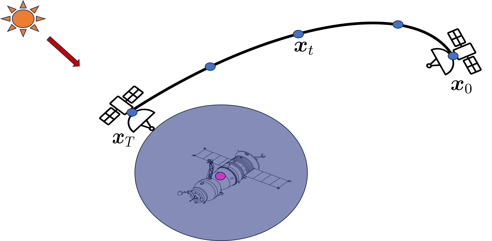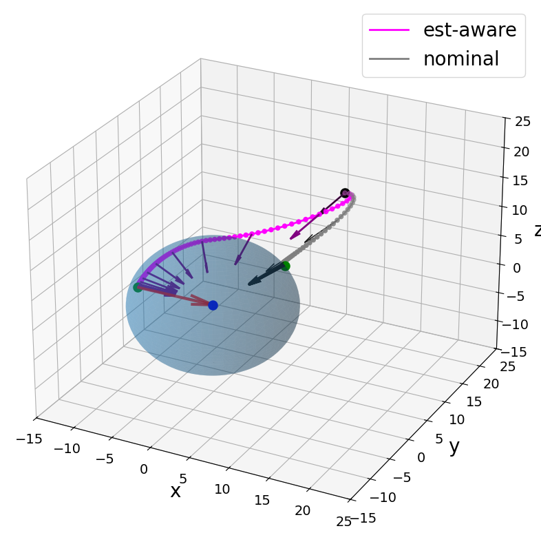
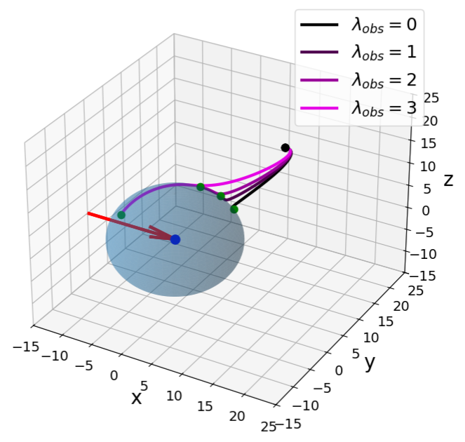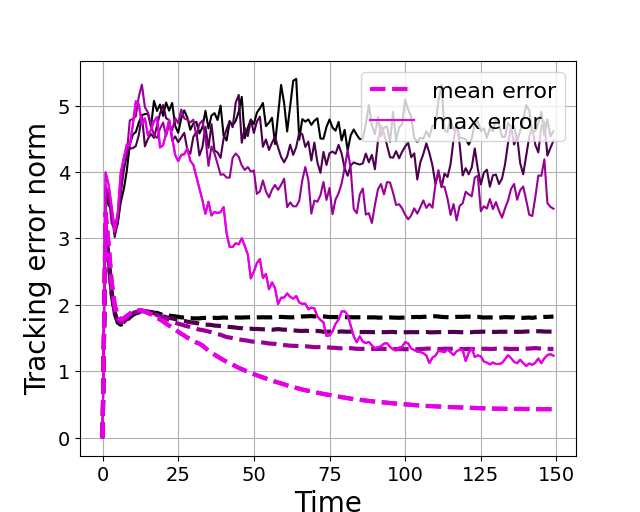
-->

### Multiagent

The same setup can be optimized even further with a network of sensors, by quantifing the dimenisons where information is missing. The SCP alrogithm is implemented here for multi-agent scenario in a sequential approach.
<!--

-->

https://github.com/user-attachments/assets/7e601fd4-2a9d-40d7-a34c-87019c0c3201

## Neuronal Dynamics
Exciting Update incoming!!!
<!--

-->
## Hardware Projects

I am a big hardware/electronics/robotics nut. I have been working on and supervising some cool educational hardware projects at Rain lab.

I helped build an inhouse drone for trajectory planning at Rain Lab :smiley:

